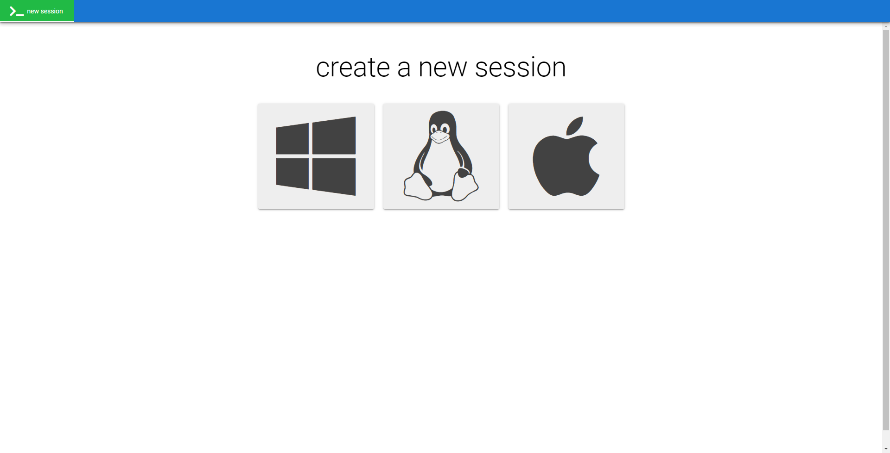
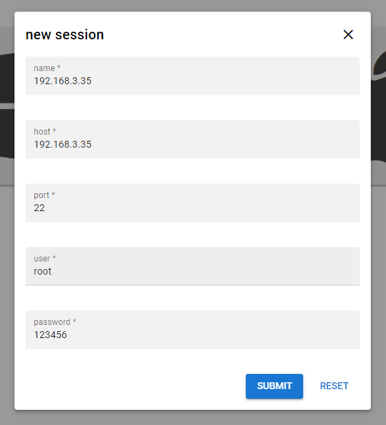
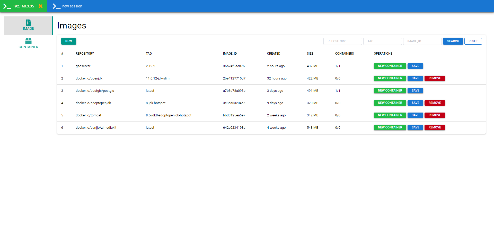
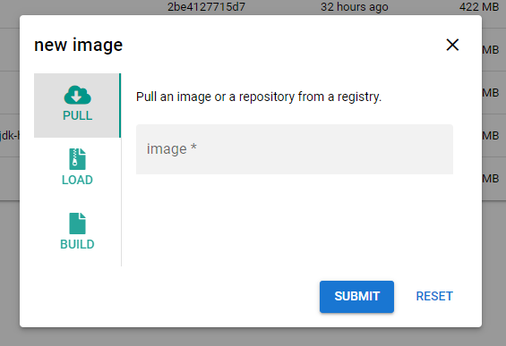
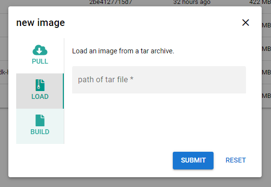
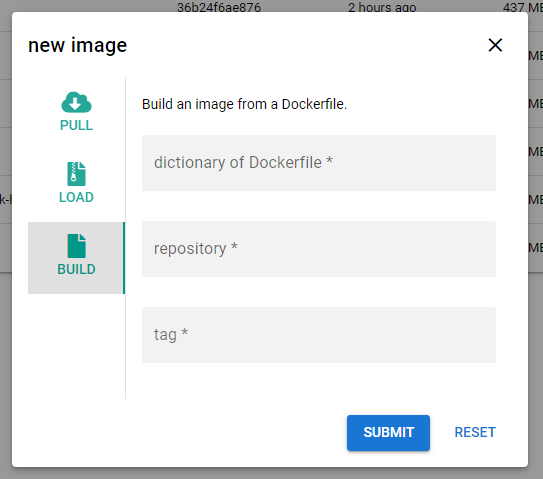
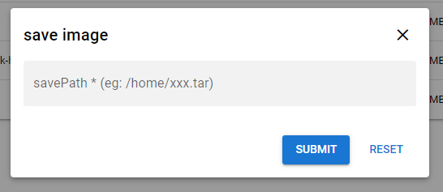
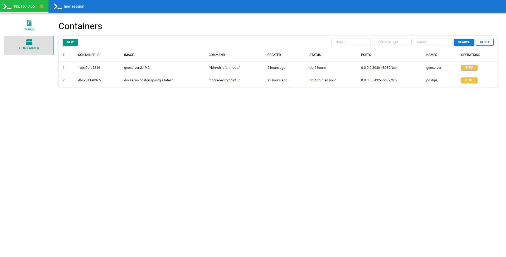
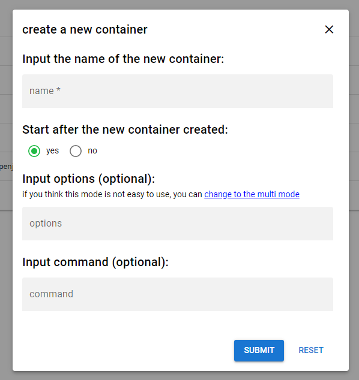

# docker-v

this is a docker management tool that you can manage your docker by web pages, eg: pull/build/load image、run/start/stop/remove container... 

and you can manage multi dockers at one time.


## 1 How to dev ?

1. clone the project.

2. dev the web pages

   ```
   cd web
   quasar dev
   ```

3. start the java main class: `cn.youyi.dockerv.AppBootstrap`


## 2 How to build ?

1. build the web pages

   ```
   cd web
   quasar build
   ```

2. execute the gradle task `"shadowJar"`, then you can get the fat jar, just execute it and open your browser and visit http://localhost:22233 !


## 3 Feature

here are the commands that docker-v support, and i will continuously add more command support .

- ✅ pull

- ✅ load

- ✅ save
- ✅ build
- ✅ rmi
- ✅ create
- ✅ run
- ✅ start
- ✅ stop
- ✅ rm
- ✅ inspect


## 4 Preview

here are some pages preview.


### 2.1 create docker session







### 2.2 query images




### 2.3 create new image

#### pull




#### load




#### build




## 2.4 save image




## 2.5 query containers



## 2.6 create new container


